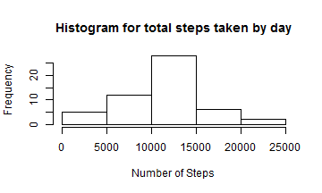
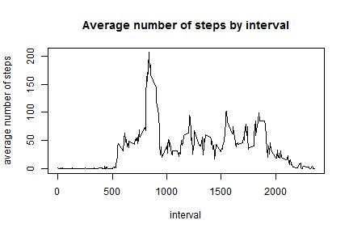
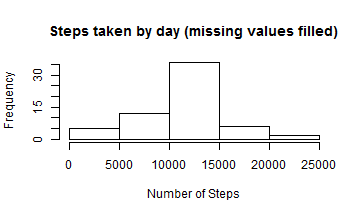
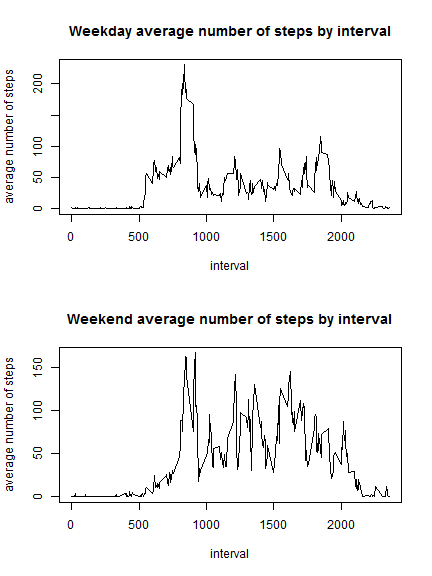

## Loading and preprocessing the data

`read.csv` allows us to load "activity.csv" into the variable dSteps.

```r
dSteps <- read.csv("activity.csv")
```


Now we need to change the date column format to a date class format.

```r
dSteps$date<-as.POSIXct(dSteps$date,format="%Y-%m-%d")
```


## What is mean total number of steps taken per day?

1. First we need to calculate the total number of steps taken by day. So we use functions `aggregate` and `sum` like this:

```r
dStepsxDay<-aggregate(dSteps$steps,list(dSteps$date),sum)
colnames(dStepsxDay)<-c("date","steps")
```


So we have dStepsxDay with the following data:

```
##         date steps
## 1 2012-10-01    NA
## 2 2012-10-02   126
## 3 2012-10-03 11352
## 4 2012-10-04 12116
## 5 2012-10-05 13294
## 6 2012-10-06 15420
```


2. Now we plot dStepsxDay in a histogram to get a general idea of the total number of steps

```r
hist(dStepsxDay$steps,main='Histogram for total steps taken by day',xlab='Number of Steps')
```

 


3. Mean and median of the total number of steps taken per day

```r
mean(dStepsxDay$steps,na.rm=TRUE)
```

```
## [1] 10766.19
```

```r
median(dStepsxDay$steps,na.rm=TRUE)
```

```
## [1] 10765
```


## What is the average daily activity pattern?

1. Similar to the previous section we start by creating a new variable. This time we store the average number of steps by interval.

```r
dStepsxInterval<-aggregate(dSteps$steps,list(dSteps$interval),mean,na.rm=TRUE)
colnames(dStepsxInterval)<-c("interval","avg_steps")
```


Plot of the average number of steps taken by interval

```r
plot(dStepsxInterval$interval,dStepsxInterval$avg_steps,type="l",main="Average number of steps by interval",xlab="interval",ylab="average number of steps")
```

 


2. Which 5-minute interval contains the maximum number of steps? To answer this question we sort the data frame by avg_steps in descending order 

```r
print(head(dStepsxInterval[order(-dStepsxInterval$avg_steps),]),row.names=FALSE)
```

```
##  interval avg_steps
##       835  206.1698
##       840  195.9245
##       850  183.3962
##       845  179.5660
##       830  177.3019
##       820  171.1509
```


So the pattern we see is low or cero activity during the night and early morning as expected. The activity peaks are around 8:00 and 9:00 in the morning. 


## Imputing missing values

1. Calculate the number of missing values

```r
sum(is.na(dSteps$steps))
```

```
## [1] 2304
```


2. Devise a strategy for filling in all of the missing values in the dataset.

We will assign the rounded average number of steps each interval has.

3. Create a new dataset with the missing values filled in.

First we get all the days with NA values:

```r
daysNA<-dStepsxDay[is.na(dStepsxDay$steps),1]
print(daysNA,max.levels=0)
```

```
## [1] "2012-10-01 COT" "2012-10-08 COT" "2012-11-01 COT" "2012-11-04 COT"
## [5] "2012-11-09 COT" "2012-11-10 COT" "2012-11-14 COT" "2012-11-30 COT"
```


Now we create a variable with the original dataset and assign to it the average number of steps per interval which we already have in variable dStepsxInterval.

```r
dSteps2<-dSteps
dSteps2[dSteps2$date %in% daysNA,1]=round(dStepsxInterval[,2],0)
```


4. Make a histogram of the total number of steps taken each day and Calculate and report the mean and median total number of steps taken per day. Do these values differ from the estimates from the first part of the assignment? What is the impact of imputing missing data on the estimates of the total daily number of steps?


```r
dSteps2xDay<-aggregate(dSteps2$steps,list(dSteps2$date),sum)
colnames(dSteps2xDay)<-c("date","steps")
```


```r
hist(dSteps2xDay$steps,main='Steps taken by day (missing values filled)',xlab='Number of Steps')
```

 


```r
mean(dSteps2xDay$steps,na.rm=TRUE)
```

```
## [1] 10765.64
```

```r
median(dSteps2xDay$steps,na.rm=TRUE)
```

```
## [1] 10762
```


Since we are using the average number of steps across all the days to fill the missing values the mean and median don't change considerably.


## Are there differences in activity patterns between weekdays and weekends?

1. Create a new factor variable in the dataset with two levels - "weekday" and "weekend" indicating whether a given date is a weekday or weekend day.

```r
dSteps2$typeDate<-as.POSIXlt(dSteps2$date)$wday
dSteps2$typeDate[dSteps2$typeDate==0 | dSteps2$typeDate==6]=0
dSteps2$typeDate[dSteps2$typeDate!=0]=1
dSteps2$typeDate <- factor(dSteps2$typeDate, labels = c("weekend", "weekday"))
```


2. Make a panel plot containing a time series plot (i.e. type = "l") of the 5-minute interval (x-axis) and the average number of steps taken, averaged across all weekday days or weekend days (y-axis). See the README file in the GitHub repository to see an example of what this plot should look like using simulated data.

```r
dStepsWeekday<-dSteps2[dSteps2$typeDate %in% "weekday",]
dSteps2xIntervalWeekday<-aggregate(dStepsWeekday$steps,list(dStepsWeekday$interval),mean,na.rm=TRUE)
colnames(dSteps2xIntervalWeekday)<-c("interval","avg_steps")

dStepsWeekend<-dSteps2[dSteps2$typeDate %in% "weekend",]
dSteps2xIntervalWeekend<-aggregate(dStepsWeekend$steps,list(dStepsWeekend$interval),mean,na.rm=TRUE)
colnames(dSteps2xIntervalWeekend)<-c("interval","avg_steps")

par(mfrow=c(2,1)) 
plot(dSteps2xIntervalWeekday$interval,dSteps2xIntervalWeekday$avg_steps,type="l",main="Weekday average number of steps by interval",xlab="interval",ylab="average number of steps")
plot(dSteps2xIntervalWeekend$interval,dSteps2xIntervalWeekend$avg_steps,type="l",main="Weekend average number of steps by interval",xlab="interval",ylab="average number of steps")
```

 
